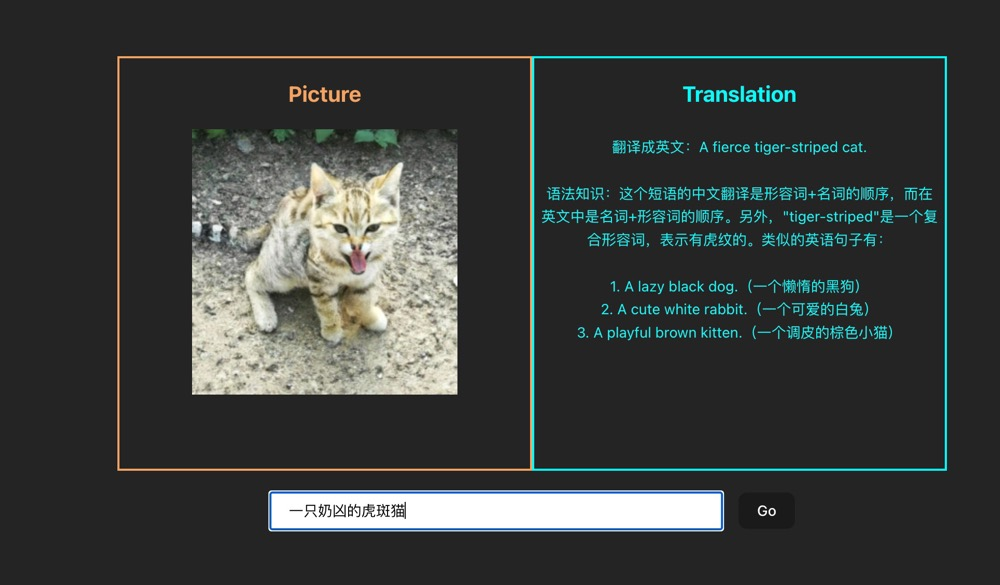
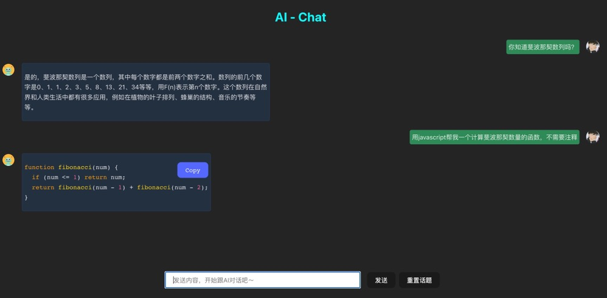
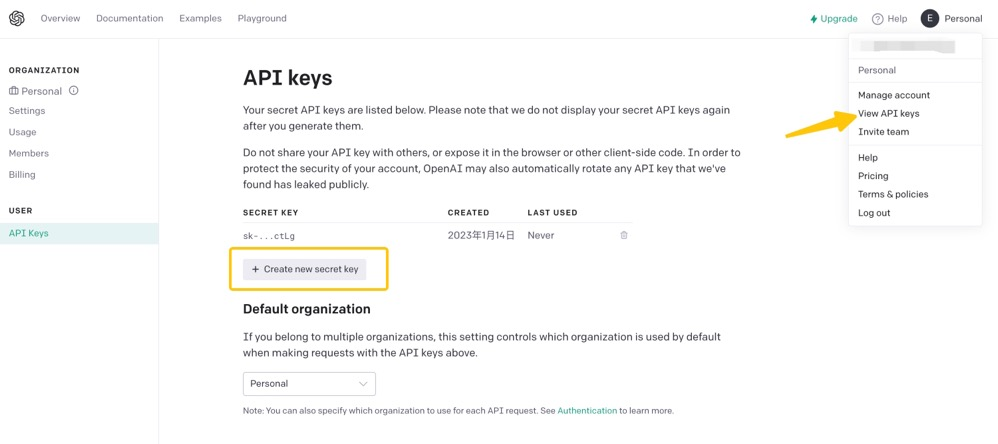
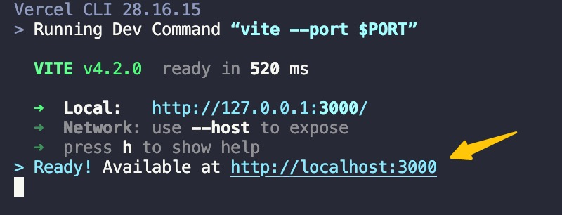

# Awesome-gpt, 基于 OpenAI 定制化的 “Chatgpt” Web 应用

## 🌟Features

- [x] 中/英互译,语法分析、例句等
- [x] 根据 prompt 生成图片
- [x] AI 智能对话
- [x] Markdown 显示支持
- [x] 代码块高亮 & 一键复制
- [x] 对话模式流式响应
- [x] 支持多会话持久化存储
- [x] 支持会话生成图片并下载
- [ ] 内置 3 种 prompt 功能

## Demo

### Demo-1

- 根据 prompt 生成符合描述的图片
- 输入英文检查拼写是否正确，是否存在语法问题，翻译成中文并补充相关示例



### Demo-2

- 类似 chatgpt 的 AI 对话机器人 🤖️



## 如何使用 🔧

1. 克隆或者 fork 本项目
2. 安装依赖 `pnpm install`

- 由于项目采用 **vercel** `Edge Functions`的模式，因此你需要事先具备 `vercel` 环境,可通过 `npm i vercel -g` 安装

3. 获取 `OPENAI_API_KEY` 信息

- 在 [OpenAI](https://beta.openai.com/) 生成你的 `OPENAI_API_KEY` , 有账号的话直接生成一个即可，没有的话需要先创建账号，具体可以自行搜索如何创建 OpenAI 账号，由于 `OpenAI` 地区限制，该环节可能需要科学上网

`OPENAI_API_KEY` 生成方式如下图所示



4. 本地运行

```bash
vercel dev
```

根据提示登录 vercel，推荐关联 github 登录，登录完成后依次回车确认完成初始化



<b style="color:pink">由于近期 OpenAI Api 访问受限，国内用户本地访问可能会出现超时</b>

5. 部署 vercel 运行（推荐）
   采用 客户端请求 `vercel` -> `vercel` 云函数请求 OpenAI API -> 结果返回客户端来绕开 Api 访问受限等问题

终端运行,等待`vercel` build 完成即可预览或者发布

```bash
vercel
```

点击终端生成的预览链接，使用第三步生成的 `OPENAI_API_KEY` 即可体验
