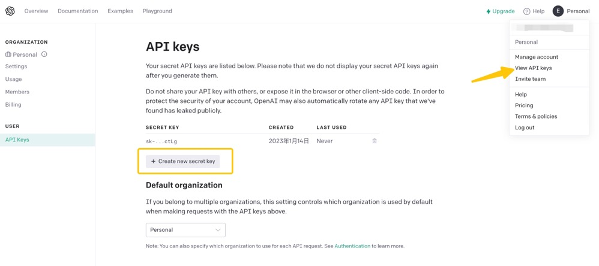
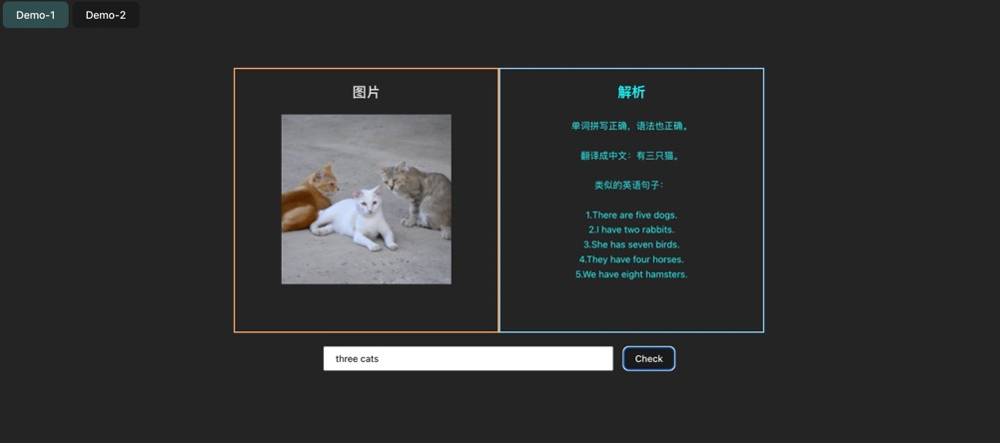
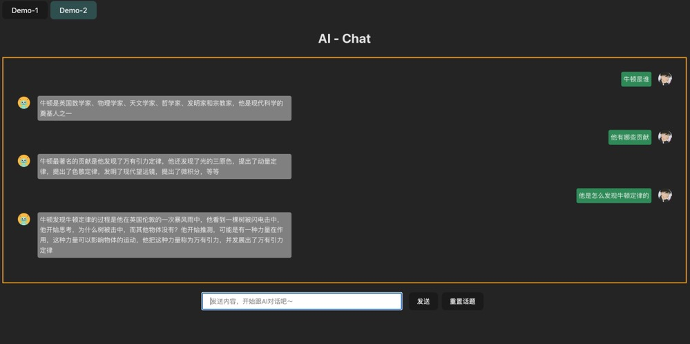

# AI 对话模型, 基于 openai

## 功能 🌟

### Demo-1

- 根据输入生成符合描述的图片
- 输入英文检查拼写是否正确，是否存在语法问题，翻译成中文并补充相关示例

### Demo-2

- 类似 chatgpt 的 AI 对话机器人 🤖️

## 如何使用 🔧

1. 克隆本项目
2. 根目录执行 `pnpm run bootstrap`

- 由于项目采用 `pnpm Monorepo `的模式，因此你需要事先具备 `pnpm` 环境,可通过 `npm i pnpm -g` 安装

3. 补充 `OPENAI_API_KEY` 信息

- 在 [openai](https://beta.openai.com/) 生成你的 `OPENAI_API_KEY` , 有账号的话直接生成一个即可，没有的话需要先创建账号，具体可以自行搜索如何创建 openai 账号，由于 `openai` 地区限制，该环节可能需要科学上网

`OPENAI_API_KEY` 生成方式如下图所示



- 在 `packages/server` 目录下新建 `.env` 文件,并填上你的 `OPENAI_API_KEY` ,格式如下

```
OPENAI_API_KEY=Your_key
```

4. 分别运行前后端服务,浏览器访问前端服务对应地址即可开始体验

packages/frontend 目录

```cmd
pnpm run start
```

packages/server 目录

```cmd
pnpm run start
```

## 功能截图




